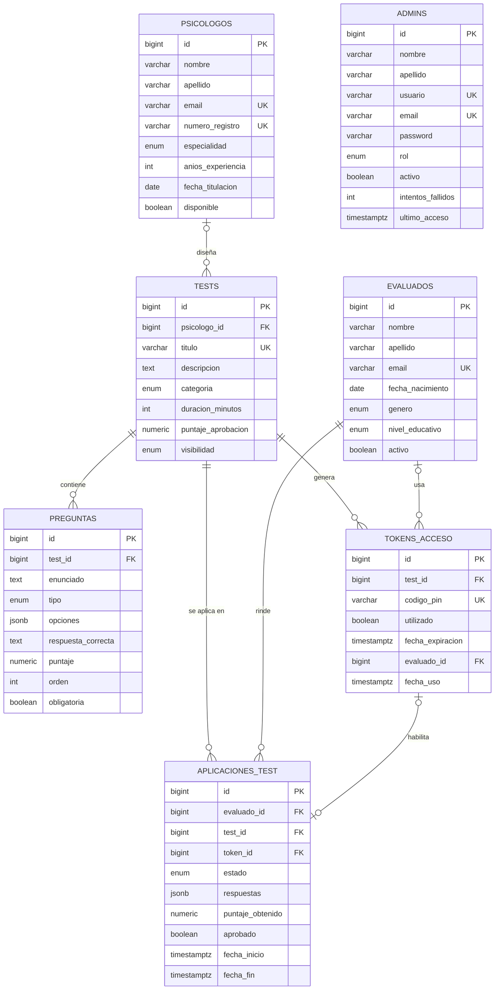

# API REST — Tests Psicométricos para Estudiantes

Taller: **Desarrollo y prueba de Endpoints REST con validación de datos en Spring Boot**.

Cada integrante del equipo desarrolla el CRUD de una de las 5 entidades principales del modelo.

## Stack

- Java 21
- Spring Boot 4.1 (`spring-boot-starter-webmvc`, `spring-boot-starter-validation`)
- Maven (wrapper incluido: `./mvnw`)
- PostgreSQL 18 + pgAdmin 4 (scripts en `database/`)

## Estructura del proyecto

```
.
├── database/                    # Scripts SQL para pgAdmin
│   ├── 00_reiniciar_esquema.sql
│   ├── 01_crear_base_datos.sql
│   ├── 02_esquema.sql
│   └── 03_datos_prueba.sql
└── src/main/java/com/psicometria/api
    ├── controllers              # Endpoints REST (/api/<entidad>)
    ├── dto                      # DTOs con anotaciones de validación
    ├── services                 # Lógica de negocio
    └── exceptions               # Excepciones y manejador global de errores
```

## Abrir y ejecutar

**IntelliJ IDEA:** `File > Open` y seleccionar la carpeta del proyecto (la que contiene `pom.xml`). IntelliJ lo importa como proyecto Maven. Ejecutar `PsicometriaApiApplication`.

**Terminal:**

```bash
./mvnw spring-boot:run
```

La API queda disponible en `http://localhost:8080`.

## Flujo de trabajo del equipo

1. Actualizar `main`: `git checkout main && git pull`
2. Crear la rama de la entidad: `git checkout -b feature/<entidad>`
3. Implementar DTO, service y controller siguiendo la estructura de `feature/evaluados`.
4. Subir la rama y abrir un Pull Request hacia `main`.

## Distribución de entidades

| # | Entidad         | Ruta base             | Rama                     |
|---|-----------------|-----------------------|--------------------------|
| 1 | `evaluados`     | `/api/evaluados`      | `feature/evaluados`      |
| 2 | `admins`        | `/api/admins`         | `feature/admins`         |
| 3 | `psicologos`    | `/api/psicologos`     | `feature/psicologos`     |
| 4 | `tests`         | `/api/tests`          | `feature/tests`          |
| 5 | `preguntas`     | `/api/preguntas`      | `feature/preguntas`      |

## Base de datos

### Crear la base en pgAdmin

1. En pgAdmin, conectarse al servidor PostgreSQL.
2. Clic derecho en la base **postgres** > **Query Tool** > abrir y ejecutar `database/01_crear_base_datos.sql` (F5).
3. Refrescar **Databases**, clic derecho en **psicometria_db** > **Query Tool**.
4. Ejecutar `database/02_esquema.sql` (tablas, tipos, índices y triggers).
5. Ejecutar `database/03_datos_prueba.sql` (datos de ejemplo, opcional).

Si el modelo cambia, ejecutar `database/00_reiniciar_esquema.sql` sobre `psicometria_db` y luego repetir los pasos 4 y 5.
**Ese script borra todas las tablas y datos**: usarlo solo en desarrollo.

> Los scripts van separados porque `CREATE DATABASE` no puede ejecutarse dentro de una transacción ni desde otra base, y pgAdmin no permite cambiar de conexión a mitad de un script. `02` y `03` se ejecutan dentro de `BEGIN ... COMMIT`, así que si algo falla no queda nada a medias.

### Entidades principales (CRUD)

| Entidad         | Atributos (además de `id`)                                                                                         |
|-----------------|--------------------------------------------------------------------------------------------------------------------|
| `evaluados`     | `nombre`, `apellido`, `email`, `fecha_nacimiento`, `genero`, `nivel_educativo`, `activo`                           |
| `admins`        | `nombre`, `apellido`, `usuario`, `email`, `password`, `rol`, `activo`, `intentos_fallidos`, `ultimo_acceso`        |
| `psicologos`    | `nombre`, `apellido`, `email`, `numero_registro`, `especialidad`, `anios_experiencia`, `fecha_titulacion`, `disponible` |
| `tests`         | `psicologo_id`, `titulo`, `descripcion`, `categoria`, `duracion_minutos`, `puntaje_aprobacion`, `visibilidad`      |
| `preguntas`     | `test_id`, `enunciado`, `tipo`, `opciones`, `respuesta_correcta`, `puntaje`, `orden`, `obligatoria`                 |

Todas incluyen texto, número, fecha o decimal, booleano y enumeración.

### Tablas de soporte (sin CRUD en el taller)

- `tokens_acceso`: PIN de un solo uso para rendir tests privados.
- `aplicaciones_test`: registro de cada vez que un evaluado rinde un test.

### Cambios respecto al modelo original

- **5 entidades CRUD**: se agrega `psicologos` y `admins` pasa a ser entidad principal; `tokens_acceso` y `aplicaciones_test` quedan como tablas de soporte.
- La plataforma atiende a **una sola institución**, por lo que no se modela una tabla de instituciones.
- `admins`: se agregan `nombre`, `apellido`, `rol` (`SUPER_ADMIN`, `ADMIN`, `LECTOR`), `intentos_fallidos`, `ultimo_acceso` y `actualizado_at`; `email` es `UNIQUE`. Por ser un taller de ejemplo, `password_hash` se reemplaza por `password` en texto plano (mínimo 8 caracteres); en un sistema real debe guardarse un hash (p. ej. BCrypt).
- Claves primarias `BIGINT GENERATED ALWAYS AS IDENTITY` (estándar SQL, recomendado sobre `SERIAL`; se mapea a `Long` en Java).
- Campos de estado como **tipos `ENUM`** en vez de `VARCHAR` libre.
- `evaluados`: `edad` se reemplaza por `fecha_nacimiento`, se separa `apellido`, se agregan `nivel_educativo` y `activo`; `email` es `UNIQUE`.
- `tests`: se agregan `psicologo_id` (autor), `categoria` y `puntaje_aprobacion`; se elimina `requiere_pin` (redundante con `visibilidad = 'PRIVADO'`).
- `preguntas`: se agregan `puntaje` y `obligatoria`; `orden` es único por test y `opciones` debe ser un arreglo JSON.
- `tokens_acceso` absorbe `historial_usos_tokens` (`evaluado_id`, `fecha_uso`) y agrega `fecha_expiracion`.
- `aplicaciones_test` referencia el token por FK y usa `puntaje_obtenido NUMERIC`, `aprobado`, `fecha_inicio` y `fecha_fin`.
- Restricciones `CHECK`/`NOT NULL`, índices en claves foráneas y trigger para `actualizado_at`.

### Diagrama entidad-relación



> Las columnas `creado_at` / `actualizado_at` se omiten del diagrama.

### Script SQL final

Resumen de las tablas. El script completo (función, triggers e índices) está en [`database/02_esquema.sql`](database/02_esquema.sql).

```sql
-- Tipos enumerados
CREATE TYPE genero_evaluado        AS ENUM ('MASCULINO', 'FEMENINO', 'NO_BINARIO', 'PREFIERO_NO_DECIR');
CREATE TYPE nivel_educativo        AS ENUM ('BASICA', 'MEDIA', 'TECNICO', 'UNIVERSITARIO', 'POSTGRADO');
CREATE TYPE rol_admin              AS ENUM ('SUPER_ADMIN', 'ADMIN', 'LECTOR');
CREATE TYPE especialidad_psicologo AS ENUM ('EDUCACIONAL', 'CLINICA', 'ORGANIZACIONAL', 'NEUROPSICOLOGIA', 'VOCACIONAL');
CREATE TYPE categoria_test         AS ENUM ('PERSONALIDAD', 'APTITUD', 'INTELIGENCIA', 'VOCACIONAL', 'EMOCIONAL');
CREATE TYPE visibilidad_test       AS ENUM ('BORRADOR', 'PRIVADO', 'PUBLICO');
CREATE TYPE tipo_pregunta          AS ENUM ('OPCION_MULTIPLE', 'VERDADERO_FALSO', 'ESCALA_LIKERT', 'RESPUESTA_ABIERTA');
CREATE TYPE estado_aplicacion      AS ENUM ('EN_PROGRESO', 'COMPLETADO', 'ABANDONADO', 'EXPIRADO');

-- ===================== ENTIDADES PRINCIPALES =====================

CREATE TABLE admins (
  id                 BIGINT GENERATED ALWAYS AS IDENTITY PRIMARY KEY,
  nombre             VARCHAR(100) NOT NULL,
  apellido           VARCHAR(100) NOT NULL,
  usuario            VARCHAR(50)  NOT NULL UNIQUE,
  email              VARCHAR(255) NOT NULL UNIQUE,
  password           VARCHAR(100) NOT NULL CHECK (char_length(password) >= 8), -- texto plano: solo para el taller
  rol                rol_admin    NOT NULL DEFAULT 'ADMIN',
  activo             BOOLEAN      NOT NULL DEFAULT TRUE,
  intentos_fallidos  INT          NOT NULL DEFAULT 0 CHECK (intentos_fallidos >= 0),
  ultimo_acceso      TIMESTAMPTZ,
  creado_at          TIMESTAMPTZ  NOT NULL DEFAULT now(),
  actualizado_at     TIMESTAMPTZ  NOT NULL DEFAULT now()
);

CREATE TABLE evaluados (
  id                BIGINT GENERATED ALWAYS AS IDENTITY PRIMARY KEY,
  nombre            VARCHAR(100)    NOT NULL,
  apellido          VARCHAR(100)    NOT NULL,
  email             VARCHAR(255)    NOT NULL UNIQUE,
  fecha_nacimiento  DATE            NOT NULL CHECK (fecha_nacimiento < CURRENT_DATE),
  genero            genero_evaluado NOT NULL DEFAULT 'PREFIERO_NO_DECIR',
  nivel_educativo   nivel_educativo NOT NULL,
  activo            BOOLEAN         NOT NULL DEFAULT TRUE,
  creado_at         TIMESTAMPTZ     NOT NULL DEFAULT now(),
  actualizado_at    TIMESTAMPTZ     NOT NULL DEFAULT now()
);

CREATE TABLE psicologos (
  id                 BIGINT GENERATED ALWAYS AS IDENTITY PRIMARY KEY,
  nombre             VARCHAR(100)           NOT NULL,
  apellido           VARCHAR(100)           NOT NULL,
  email              VARCHAR(255)           NOT NULL UNIQUE,
  numero_registro    VARCHAR(30)            NOT NULL UNIQUE,
  especialidad       especialidad_psicologo NOT NULL,
  anios_experiencia  INT                    NOT NULL DEFAULT 0 CHECK (anios_experiencia BETWEEN 0 AND 60),
  fecha_titulacion   DATE                   NOT NULL CHECK (fecha_titulacion <= CURRENT_DATE),
  disponible         BOOLEAN                NOT NULL DEFAULT TRUE,
  creado_at          TIMESTAMPTZ            NOT NULL DEFAULT now(),
  actualizado_at     TIMESTAMPTZ            NOT NULL DEFAULT now()
);

CREATE TABLE tests (
  id                  BIGINT GENERATED ALWAYS AS IDENTITY PRIMARY KEY,
  psicologo_id        BIGINT           REFERENCES psicologos(id) ON DELETE SET NULL,
  titulo              VARCHAR(255)     NOT NULL UNIQUE,
  descripcion         TEXT,
  categoria           categoria_test   NOT NULL,
  duracion_minutos    INT              CHECK (duracion_minutos IS NULL OR duracion_minutos > 0), -- NULL = sin límite
  puntaje_aprobacion  NUMERIC(5,2)     NOT NULL DEFAULT 60.00 CHECK (puntaje_aprobacion BETWEEN 0 AND 100),
  visibilidad         visibilidad_test NOT NULL DEFAULT 'BORRADOR',
  creado_at           TIMESTAMPTZ      NOT NULL DEFAULT now(),
  actualizado_at      TIMESTAMPTZ      NOT NULL DEFAULT now()
);

CREATE TABLE preguntas (
  id                  BIGINT GENERATED ALWAYS AS IDENTITY PRIMARY KEY,
  test_id             BIGINT        NOT NULL REFERENCES tests(id) ON DELETE CASCADE,
  enunciado           TEXT          NOT NULL,
  tipo                tipo_pregunta NOT NULL,
  opciones            JSONB,
  respuesta_correcta  TEXT,
  puntaje             NUMERIC(5,2)  NOT NULL DEFAULT 1.00 CHECK (puntaje >= 0),
  orden               INT           NOT NULL CHECK (orden > 0),
  obligatoria         BOOLEAN       NOT NULL DEFAULT TRUE,
  CONSTRAINT uq_preguntas_test_orden UNIQUE (test_id, orden),
  CONSTRAINT ck_preguntas_opciones CHECK (opciones IS NULL OR jsonb_typeof(opciones) = 'array')
);

-- ===================== TABLAS DE SOPORTE =====================

CREATE TABLE tokens_acceso (
  id                BIGINT GENERATED ALWAYS AS IDENTITY PRIMARY KEY,
  test_id           BIGINT       NOT NULL REFERENCES tests(id) ON DELETE CASCADE,
  codigo_pin        VARCHAR(50)  NOT NULL UNIQUE,
  utilizado         BOOLEAN      NOT NULL DEFAULT FALSE,
  fecha_expiracion  TIMESTAMPTZ  NOT NULL,
  evaluado_id       BIGINT       REFERENCES evaluados(id) ON DELETE SET NULL,
  fecha_uso         TIMESTAMPTZ,
  creado_at         TIMESTAMPTZ  NOT NULL DEFAULT now(),
  CONSTRAINT ck_tokens_uso CHECK (utilizado = (fecha_uso IS NOT NULL))
);

CREATE TABLE aplicaciones_test (
  id                BIGINT GENERATED ALWAYS AS IDENTITY PRIMARY KEY,
  evaluado_id       BIGINT            NOT NULL REFERENCES evaluados(id) ON DELETE CASCADE,
  test_id           BIGINT            NOT NULL REFERENCES tests(id) ON DELETE CASCADE,
  token_id          BIGINT            UNIQUE REFERENCES tokens_acceso(id) ON DELETE SET NULL,
  estado            estado_aplicacion NOT NULL DEFAULT 'EN_PROGRESO',
  respuestas        JSONB             NOT NULL DEFAULT '{}',
  puntaje_obtenido  NUMERIC(5,2)      CHECK (puntaje_obtenido BETWEEN 0 AND 100),
  aprobado          BOOLEAN,
  fecha_inicio      TIMESTAMPTZ       NOT NULL DEFAULT now(),
  fecha_fin         TIMESTAMPTZ,
  actualizado_at    TIMESTAMPTZ       NOT NULL DEFAULT now(),
  CONSTRAINT ck_aplicaciones_fechas CHECK (fecha_fin IS NULL OR fecha_fin >= fecha_inicio)
);
```

## Formato de errores

Todas las entidades comparten el manejador global de `exceptions`:

```json
{
  "timestamp": "2026-09-14T10:15:30",
  "status": 400,
  "error": "Bad Request",
  "message": "Error de validación",
  "path": "/api/evaluados",
  "errores": {
    "email": "El email debe tener un formato válido"
  }
}
```
