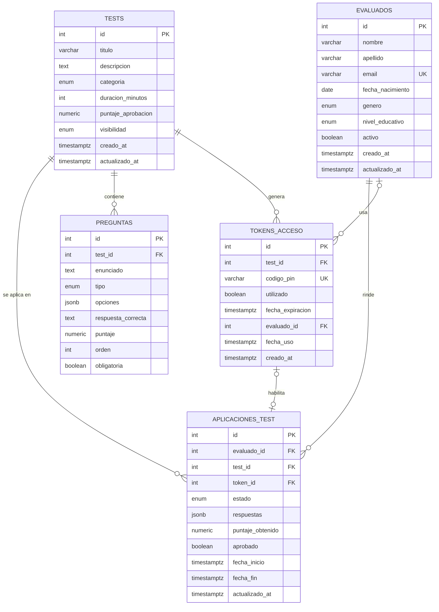

# API REST — Tests Psicométricos para Estudiantes

Taller: **Desarrollo y prueba de Endpoints REST con validación de datos en Spring Boot**.

Cada integrante del equipo desarrolla el CRUD de una de las 5 entidades principales del modelo.

## Stack

- Java 21
- Spring Boot 4.1 (`spring-boot-starter-webmvc`, `spring-boot-starter-validation`)
- Maven (wrapper incluido: `./mvnw`)
- PostgreSQL (modelo de datos, ver `database/schema.sql`)

## Estructura del proyecto

```
src/main/java/com/psicometria/api
├── controllers   # Endpoints REST (/api/<entidad>)
├── dto           # DTOs con anotaciones de validación
├── services      # Lógica de negocio
└── exceptions    # Excepciones y manejador global de errores
```

## Ejecutar

```bash
./mvnw spring-boot:run
```

La API queda disponible en `http://localhost:8080`.

## Distribución de entidades

| # | Entidad             | Ruta base                  | Rama                    |
|---|---------------------|----------------------------|-------------------------|
| 1 | `evaluados`         | `/api/evaluados`           | `feature/evaluados`     |
| 2 | `tests`             | `/api/tests`               | `feature/tests`         |
| 3 | `preguntas`         | `/api/preguntas`           | `feature/preguntas`     |
| 4 | `tokens_acceso`     | `/api/tokens-acceso`       | `feature/tokens-acceso` |
| 5 | `aplicaciones_test` | `/api/aplicaciones-test`   | `feature/aplicaciones-test` |

## Base de datos

### Cambios respecto al modelo original

- **5 entidades CRUD** con identificador y al menos 5 atributos de distintos tipos (texto, número, fecha, booleano, enumeración).
- Los campos de estado pasan de `VARCHAR` libre a **tipos `ENUM`** (`genero`, `nivel_educativo`, `categoria`, `visibilidad`, `tipo`, `estado`).
- `evaluados`: `edad` se reemplaza por `fecha_nacimiento` (no queda desactualizada), se separa `apellido`, se agregan `nivel_educativo` y `activo`, y `email` pasa a ser `UNIQUE`.
- `tests`: se agregan `categoria` y `puntaje_aprobacion`; se elimina `requiere_pin` porque era redundante con `visibilidad = 'PRIVADO'`.
- `preguntas`: se agregan `puntaje` y `obligatoria`; `orden` es único por test.
- `tokens_acceso`: se agrega `fecha_expiracion` y absorbe la tabla `historial_usos_tokens` (`evaluado_id`, `fecha_uso`), ya que un PIN es de un solo uso.
- `aplicaciones_test`: referencia al token por FK (`token_id`) en vez de copiar el PIN, `nota_final INT` pasa a `puntaje_obtenido NUMERIC`, y se agregan `aprobado`, `fecha_inicio` y `fecha_fin`.
- `admins` queda como tabla de soporte para autenticación (fuera del CRUD del taller).
- Restricciones `CHECK`, `NOT NULL`, índices en claves foráneas y trigger para `actualizado_at`.

### Diagrama entidad-relación



### Script SQL final

El mismo script está en [`database/schema.sql`](database/schema.sql).

```sql
-- Tipos enumerados
CREATE TYPE genero_evaluado   AS ENUM ('MASCULINO', 'FEMENINO', 'NO_BINARIO', 'PREFIERO_NO_DECIR');
CREATE TYPE nivel_educativo   AS ENUM ('BASICA', 'MEDIA', 'TECNICO', 'UNIVERSITARIO', 'POSTGRADO');
CREATE TYPE categoria_test    AS ENUM ('PERSONALIDAD', 'APTITUD', 'INTELIGENCIA', 'VOCACIONAL', 'EMOCIONAL');
CREATE TYPE visibilidad_test  AS ENUM ('BORRADOR', 'PRIVADO', 'PUBLICO');
CREATE TYPE tipo_pregunta     AS ENUM ('OPCION_MULTIPLE', 'VERDADERO_FALSO', 'ESCALA_LIKERT', 'RESPUESTA_ABIERTA');
CREATE TYPE estado_aplicacion AS ENUM ('EN_PROGRESO', 'COMPLETADO', 'ABANDONADO', 'EXPIRADO');

-- Soporte: admins
CREATE TABLE admins (
  id             SERIAL PRIMARY KEY,
  usuario        VARCHAR(100) NOT NULL UNIQUE,
  email          VARCHAR(255) NOT NULL UNIQUE,
  password_hash  VARCHAR(255) NOT NULL,
  activo         BOOLEAN      NOT NULL DEFAULT TRUE,
  creado_at      TIMESTAMPTZ  NOT NULL DEFAULT now()
);

-- 1. evaluados
CREATE TABLE evaluados (
  id                SERIAL PRIMARY KEY,
  nombre            VARCHAR(100)    NOT NULL,
  apellido          VARCHAR(100)    NOT NULL,
  email             VARCHAR(255)    NOT NULL UNIQUE,
  fecha_nacimiento  DATE            NOT NULL CHECK (fecha_nacimiento < CURRENT_DATE),
  genero            genero_evaluado NOT NULL DEFAULT 'PREFIERO_NO_DECIR',
  nivel_educativo   nivel_educativo NOT NULL,
  activo            BOOLEAN         NOT NULL DEFAULT TRUE,
  creado_at         TIMESTAMPTZ     NOT NULL DEFAULT now(),
  actualizado_at    TIMESTAMPTZ     NOT NULL DEFAULT now()
);

-- 2. tests
CREATE TABLE tests (
  id                  SERIAL PRIMARY KEY,
  titulo              VARCHAR(255)     NOT NULL,
  descripcion         TEXT,
  categoria           categoria_test   NOT NULL,
  duracion_minutos    INT              CHECK (duracion_minutos IS NULL OR duracion_minutos > 0), -- NULL = sin límite
  puntaje_aprobacion  NUMERIC(5,2)     NOT NULL DEFAULT 60.00 CHECK (puntaje_aprobacion BETWEEN 0 AND 100),
  visibilidad         visibilidad_test NOT NULL DEFAULT 'BORRADOR',
  creado_at           TIMESTAMPTZ      NOT NULL DEFAULT now(),
  actualizado_at      TIMESTAMPTZ      NOT NULL DEFAULT now()
);

-- 3. preguntas
CREATE TABLE preguntas (
  id                  SERIAL PRIMARY KEY,
  test_id             INT           NOT NULL REFERENCES tests(id) ON DELETE CASCADE,
  enunciado           TEXT          NOT NULL,
  tipo                tipo_pregunta NOT NULL,
  opciones            JSONB,
  respuesta_correcta  TEXT,
  puntaje             NUMERIC(5,2)  NOT NULL DEFAULT 1.00 CHECK (puntaje >= 0),
  orden               INT           NOT NULL CHECK (orden > 0),
  obligatoria         BOOLEAN       NOT NULL DEFAULT TRUE,
  CONSTRAINT uq_preguntas_test_orden UNIQUE (test_id, orden)
);

-- 4. tokens_acceso
CREATE TABLE tokens_acceso (
  id                SERIAL PRIMARY KEY,
  test_id           INT          NOT NULL REFERENCES tests(id) ON DELETE CASCADE,
  codigo_pin        VARCHAR(50)  NOT NULL UNIQUE,
  utilizado         BOOLEAN      NOT NULL DEFAULT FALSE,
  fecha_expiracion  TIMESTAMPTZ  NOT NULL,
  evaluado_id       INT          REFERENCES evaluados(id) ON DELETE SET NULL,
  fecha_uso         TIMESTAMPTZ,
  creado_at         TIMESTAMPTZ  NOT NULL DEFAULT now(),
  CONSTRAINT ck_tokens_uso CHECK (utilizado = (fecha_uso IS NOT NULL))
);

-- 5. aplicaciones_test
CREATE TABLE aplicaciones_test (
  id                SERIAL PRIMARY KEY,
  evaluado_id       INT               NOT NULL REFERENCES evaluados(id) ON DELETE CASCADE,
  test_id           INT               NOT NULL REFERENCES tests(id) ON DELETE CASCADE,
  token_id          INT               UNIQUE REFERENCES tokens_acceso(id) ON DELETE SET NULL,
  estado            estado_aplicacion NOT NULL DEFAULT 'EN_PROGRESO',
  respuestas        JSONB             NOT NULL DEFAULT '{}',
  puntaje_obtenido  NUMERIC(5,2)      CHECK (puntaje_obtenido BETWEEN 0 AND 100),
  aprobado          BOOLEAN,
  fecha_inicio      TIMESTAMPTZ       NOT NULL DEFAULT now(),
  fecha_fin         TIMESTAMPTZ       CHECK (fecha_fin IS NULL OR fecha_fin >= fecha_inicio),
  actualizado_at    TIMESTAMPTZ       NOT NULL DEFAULT now()
);
```

> El script completo (con triggers de `actualizado_at` e índices) está en `database/schema.sql`.

## Formato de errores

Todas las entidades comparten el manejador global de `exceptions`:

```json
{
  "timestamp": "2026-09-14T10:15:30",
  "status": 400,
  "error": "Bad Request",
  "message": "Error de validación",
  "path": "/api/evaluados",
  "errores": {
    "email": "El email debe tener un formato válido"
  }
}
```
